# The APLX File Format
Steve Temple — 25 Nov 2011 — Version 1.00

# Introduction
APLX format is a simple format for binary files which are intended for loading onto SpiNNaker systems. The files may contain programs for execution and/or data to be used by executing programs. An APLX file contains an APLX header block which defines how the data is to be loaded into SpiNNaker memory and also a number of data blocks which will be loaded into memory. Normally, the header will be at the start of the file and the data will follow but this is not compulsory. All data in the APLX header is in Little-Endian format. Since SpiNNaker is a Little-Endian system, it is usually the case that data in any data blocks is also Little-Endian but it need not be so.

# APLX Header

## Format
The header block contains a number of 4 word command entries (each word is 4 bytes). Each command entry contains a command word and three argument words. There are currently 4 commands defined (and an end marker).

| Command      | Code | Function                          |
| ------------ | ---- | --------------------------------- |
| `APLX_ACOPY` | 1    | Copy data (from absolute address) |
| `APLX_RCOPY` | 2    | Copy data (from relative address) |
| `APLX_FILL`  | 3    | Fill memory with a data value     |
| `APLX_EXEC`  | 4    | Start program execution           |
| `APLX_END`   | -1   | Signals end of APLX header        |

The normal mode of operation on SpiNNaker is that an APLX file is loaded in its entirety to an area of unused memory such as SDRAM or SYSRAM. Code running on SpiNNaker then parses the APLX header and performs the copy/fill/etc commands in the header. This will result in the data being copied to other parts of SpiNNaker memory. Often the final command in the header will be `APLX_EXEC` which causes SpiNNaker to start executing a new program.

A typical APLX file has the following structure:

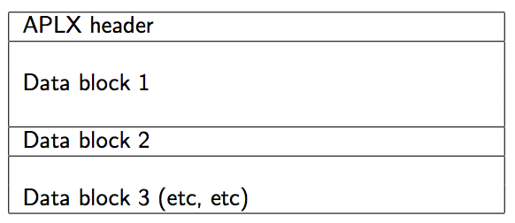

And the APLX header has the following structure (fields are 4 words each):

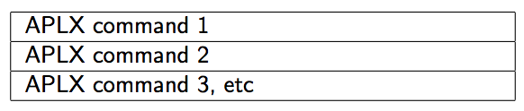

Each command has the following structure (fields are 1 word each):

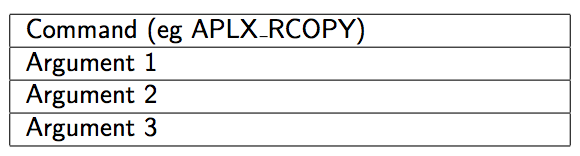

## `APLX_ACOPY` command
This command copies data from one absolute address to another. `Arg1` is the destination address, `Arg2` is the source address and `Arg3` is the length in bytes. The copy is actually done word by word and the length is rounded up to a multiple of 32 bytes. Specifying a zero length is not permitted.

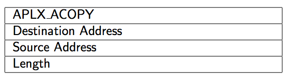

## `APLX_RCOPY` command
This command copies data from an address _relative_ to the start of this APLX command block to an _absolute_ destination address. `Arg1` is the destination address, `Arg2` is the source address (an offset) and `Arg3` is the length in bytes. The copy is done in the same way as `APLX_ACOPY` and zero length is not permitted.

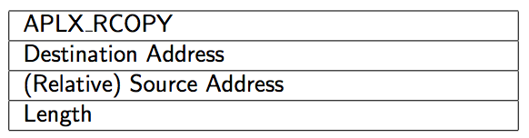

For example, if the data block to be copied was 64 bytes further on in the APLX file than the start of the `APLX_RCOPY` command block, it would be appropriate to provide 64 for `Arg2`.

## `APLX_FILL` command
This command fills an area of memory with a specified data word. `Arg1` is the start address of the memory area, `Arg2` is the length in bytes and `Arg3` is the word to be used for filling. The length is rounded up to a multiple of 32 bytes and specifying a zero length is not permitted.

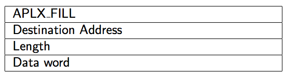

## `APLX_EXEC` command
This command causes program execution to begin at a specific address. `Arg1` is the address to execute at and `Arg2` and `Arg3` are unused. The address is placed in an ARM register and a _BLX_ instruction is used to do the branch. This means that the code can be entered in either ARM or Thumb mode. If the code preserves the link register on entry it is also possible to return to the APLX loader to continue parsing the APLX command header.

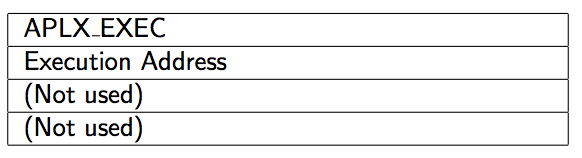

## `APLX_END` command
Parsing of the APLX command block ends when an `APLX_END` command or an invalid command is found; all arguments are ignored. At this point control will return to the program which called the APLX loader. Typically, this will be a monitor or debug program. If the final command in the block is `APLX_EXEC` and it is not expected that the code will return, no `APLX_END` is needed.

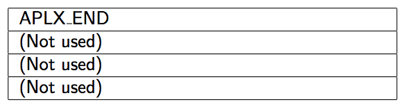

# Using APLX to download C programs
APLX was originally developed to aid in the download of C programs which typically need to be _scatter loaded_. A C program generally requires 3 parts of memory to be initialised.

The first part is the program code itself which needs to be placed at the address from which it is to execute. On SpiNNaker this is typically in ITCM and usually at address 0.

The second part is those C static (global) variables which were initialised (to non-zero values) in the C source code. The initial values of these variables need to be copied to the appropriate addresses where they can be accessed by the executing code. On SpiNNaker this is usually in DTCM.

The third part is the remainder of the C static variables. These were not explicitly initialised in the C source and need to be initialised to zero before execution begins. Again, these usually live in DTCM.

An APLX file for a C program therefore contains a header to perform the necessary loading and filling and also to start execution of the code. There will also be two data blocks, one for the program code and one for the initialised variable data. The structure is as follows:

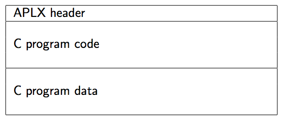

The header will contain four commands as follows:

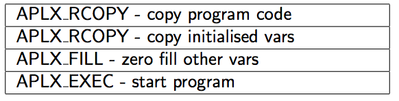

# Self-extracting APLX Files
Normally, an APLX file is unpacked after it has been loaded into SpiNNaker memory by an already resident piece of unpacking code. It is also possible to prepend unpacking code onto an APLX file and then load that into SpiNNaker memory. The unpacking code is small (128 bytes). The file can then be unpacked by starting execution of the unpacking code at the appropriate point. This will generally be at the start of the file.

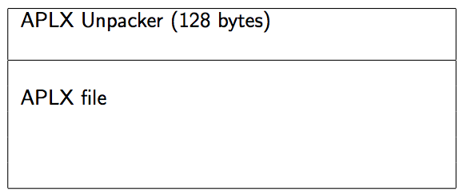

