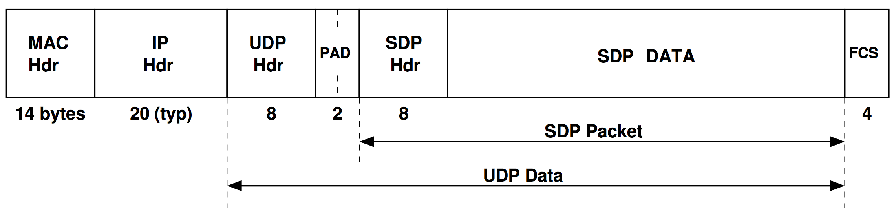

# SpiNNaker Datagram Protocol (SDP) Specification
Steve Temple — 07 Nov 2011 — Version 1.01

_(This document is also available as [PDF](http://spinnakermanchester.github.io/docs/spinn-app-4.pdf).)_

# Introduction

SDP is a protocol for moving blocks of data in a SpiNNaker system. It provides a basic, non-guaranteed point-to-point communication method which may be used as-is, or with additional control mechanisms to provide more reliable data transport.

Data is sent in packets or datagrams which can contain up to ~64 kbytes of data. The current implementation limits the amount of data to ~256 bytes in order to mimimise the size of buffers in the SpiNNaker chips.

Each SDP packet contains an SDP header which controls the addressing of the packet and a data field which holds the payload. It is necessary to be aware of the length of the packet but this is considered the responsibility of the agent conveying the packet and does not occupy a specific field in the packet.

SDP packets may be conveyed by a variety of mechanisms. For example, between SpiNNaker chips they are conveyed as sequences of point-to-point SpiNNaker packets. When sent over the Internet, they are usually embedded in UDP packets. Each of the various transit mechanisms will have its own way of conveying the packet length and may also carry out integrity checking on the data.

An SDP packet embedded in a Ethernet-based UDP packet is shown in the diagram below.

# SDP Addressing

SDP provides a point-to-point communication mechanism and an addressing scheme is required to identify the endpoints. An SDP address occupies 3 bytes and has three fields. Two of the bytes specify a 16-bit chip number in a SpiNNaker system. This is the same as the address used for SpiNNaker point-to-point packets and identifies a particular chip in a SpiNNaker system. A scheme which numbers chips according to their position in a 2D grid has been adopted and the 16-bit address may be viewed as 2 bytes. The high byte is the X coordinate in the grid and the low byte is the Y coordinate.

The third byte of the SDP address is divided into two fields. The low 5 bits is a _Virtual CPU number_ which identifies a particular core (or CPU) on a SpiNNaker chip. The high 3 bits is a _port number_ which allows the SDP packet to be addressed to a particular process on that core. The convention has been adopted that port 0 is reserved for communication with the kernel on a core and ports 1 to 7 are for applications.

## Virtual CPUs

Each core (CPU) on a SpiNNaker chip has a hard-wired identifier in the range 0 to 17. This is the _Physical_ CPU number. Following reset, one of the cores is chosen arbitrarily as a Monitor Processor and the others become Application Processors. One or more cores may also be nonfunctional.

To allow cores to be addressed in a logical manner, the kernel software assigns _Virtual_ CPU numbers when it starts up. The Monitor Processor is Virtual CPU 0 (zero) and the Application processors are numbered from 1 upwards. Non-functional CPUs are excluded and the kernel maintains tables which detail the mapping between Virtual and Physical CPU numbers.

SDP always works in terms of Virtual CPUs numbers.

## Internet Addressing

SDP packets can be routed to and from arbitrary endpoints in the Internet. An Internet endpoint can be specified as a duple of an IP address (32 bits in IPV4) and a port number (16 bits). Rather than carry this information around in every SDP packet, tables are maintained at each SpiNNaker node which has an Internet connection which map the 48 bit Internet endpoint to an 8-bit quantity (an _IPTag_) which is more efficient to carry in every SDP packet. As SDP packets pass through this node, the IPTag is used to route packets onto the Internet as appropriate.

# SDP Header

The SDP header is an 8 byte field which is used to route SDP packets. The components of the field are as shown in the struct definition and diagram below.

	typedef struct             // SDP header
	{
	    uchar flags;           // Flag byte
	    uchar tag;             // IP Tag byte
	    uchar dest_port_cpu;   // Destination Port & CPU
	    uchar srce_port_cpu    // Source Port & CPU
	    ushort dest_addr;      // Destination P2P Address
	    ushort srce_addr;      // Source P2P Address
	} sdp_hdr_t;

The `Flags` field is used internally by the SDP protocol code. It should be initialised to either 0x87 or 0x07 depending on whether or not a reply packet is expected.

The `Tag` field is an IPTag number which is used when the packet is being sent over a network which uses standard IPv4 routing. If the packet is just being sent internally inside a SpiNNaker machine this field is not used and should be set to zero. See below for notes on IPTags.

The `Dest Addr` field is the point-to-point address of the destination SpiNNaker node. It follows the convention that the X coordinate of the node is in the high byte and the Y coordinate is in the low byte.

The `Srce Addr` field is the point-to-point address of the sending node.

The `Dest Port/CPU` field contains the (5-bit) virtual CPU number of the destination CPU and a 3 bit port number. These two fields are packed into a byte with the port in the top 3 bits. The `Srce CPU/Port` contains similar information relating to the sending CPU. Port 0 is reserved for debugging purposes and ports 1-7 are passed directly to applications.

The value (`Port=7`, `CPU=31`) is special in that this is used to indicate to an Ethernet connected node that the packet should be routed out onto the Internet. In this case, the `Tag` field specifies the IPTag to be used.

Note that all fields must be filled by application software - the source address, CPU and port are not supplied automatically.

When a packet arrives at a destination and the application wishes to reply to the sender using the same packet, the `Srce` and `Dest` fields may be swapped to achieve this.

# SDP Length

Where the length of an SDP packet needs to be specified, the value that should be used is the total length of SDP header and SDP data fields. As the header occupies 8 bytes the length should be specified as 8 plus the number of SDP data bytes. The minimum length of an SDP packet is therefore 8.

# IPTags

An IPTag is a small integer (0..254) which is used to allow SDP packets to be routed to an IP address and port number. SpiNNaker nodes which have an Ethernet interface maintain a table indexed by IPTags which provides the mapping between a tag and the IPaddr/port pair.

IPTags may be either permanent or transient. Permanent IPTags are explicitly created and removed by a command given to SC&MP either by a host or a SpiNNaker application.

Transient IPTags are created when an SDP packet arrives at a SpiNNaker node via UDP and a reply packet is expected. In this case a transient IPTag is created based on the IP address and reply port of the incoming UDP packet. This is passed to the destination in the SDP packet and quoted in the reply SDP packet. When the reply reaches the Ethernet-attached node the IPTag is used to route the reply UDP packet and the IPTag table entry is deleted at that point.

IPTags can have a timeout associated with them so that if the reply associated with a transient tag fails to arrive, the table entry can be reclaimed. The IPTag table in the first SC&MP implementation contains 16 entries of which the first 4 are reserved for permanent IPTags.

# Embedding SDP in UDP

When an SDP packet is being conveyed in a UDP packet it is placed in the UDP data field. The length of the SDP packet can be inferred from the length specified in the UDP header and the checksum in the UDP header is used to check the integrity of the SDP packet.

Because most UDP packets are carried over Ethernet, the start of the UDP data field is not 4-byte aligned. In order to make the start of the SDP packet aligned to a 4 byte boundary (which makes processing in SpiNNaker rather easier), a 2 byte pad field is placed at the start of the UDP data field.

The first of these 2 bytes is currently used to allow the timeout field of an IPTag created by the reception of the packet to be specified. The second byte is reserved and should be set to zero.

Valid values for the timeout byte are 0 to 16 as follows

| Value | Timeout (ms) |
| ----- | ------------ |
| 0 | No (infinite) timout |
| 1 | 10 ms |
| 2 | 20 ms |
| ... |
| N | 10 * 2N−1 ms |
| ... |
| 16 | 327680 ms |

# SpiNNaker Command Protocol (SCP)

SDP packets are used extensively for conveying commands and responses to those commands around a SpiNNaker system. In order to do this, further structure is imposed on the SDP packet by subdividing the SDP data field. The data field is split into 6 fields as shown in the diagram below:

The `cmd_rc` field is a code indicating the command that is being specified in the case of a packet conveying a command. Where the packet is a response to a command, the `cmd_rc` field indicates a return code following execution of the command.

The `seq` field may be used for error checking to detect lost packets and to allow for a retry mechanism.

The fields `arg1`, `arg2` and `arg3` are provided to allow 32-bit arguments or return values to be transported while the `data` field allows arbitrary data structures to be conveyed. At present, this field is limited to 256 bytes.

All SpiNNaker cores are expected to receive and respond to SDP/SCP command packets sent to them on port 0. A number of commands are already defined to assist with program loading and debugging. SCP is more extensively documented in another AppNote.
