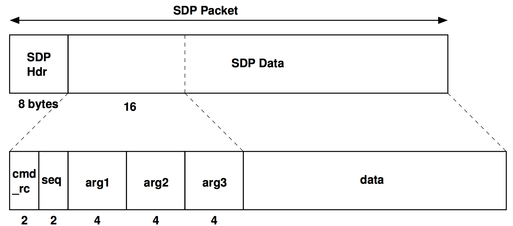
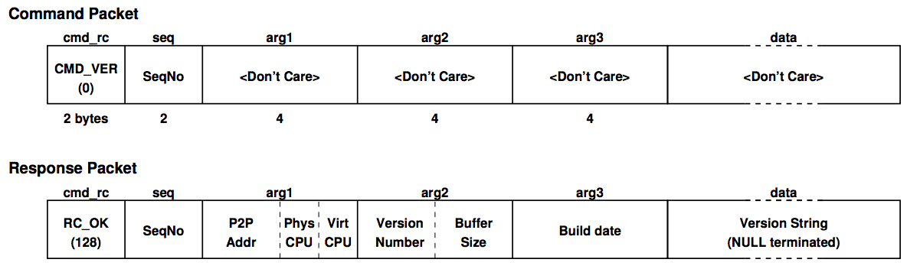
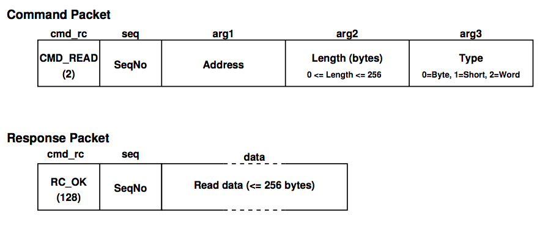
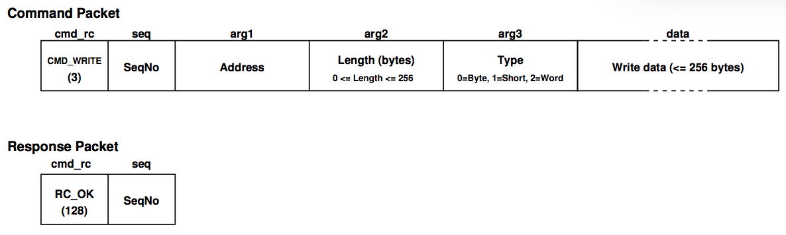
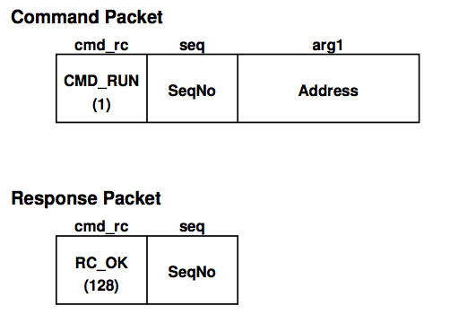
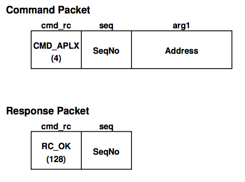

# Spinnaker Command Protocol (SCP) Specification
Steve Temple — 28 Nov 2011 — Version 1.00

# Introduction
The SpiNNaker Command Protocol is a data format imposed on the data field of an SDP packet. It consists of a fixed-length header followed by a variable sized data field. It is used for low-level interactions with SpiNNaker systems for program loading and debugging. It is suggested that it also be used in applications wherever a similar facility is needed in order to facilitate code re-use. It is frequently used to carry a command to a SpiNNaker core and then to convey a response from that command back to the originator.

The following C struct definition describes the layout of SCP data.

    typedef struct {
        ushort cmd_rc;            // Command/Return Code
        ushort seq;               // Sequence number
        uint arg1;                // Arg 1
        uint arg2;                // Arg 2
        uint arg3;                // Arg 3
        uchar data[SDP_BUF_SIZE]; // User data (256 bytes)
    } sdp_cmd_t;

The 16-bit `cmd_rc` field is a code indicating the command that is being specified in the case of a packet conveying a command. Where the packet is a response to a command, the `cmd_rc` field indicates a return code following execution of the command.

The 16-bit `seq` field may be used for error checking to detect lost packets and to allow for a retry mechanism. If the field is not being used it should be set to zero.

The fields `arg1`, `arg2` and `arg3` are provided to allow 32-bit arguments or return values to be transported while the `data` field allows arbitrary data structures to be conveyed. At present, this field is limited to 256 bytes.

In common with the rest of SpiNNaker, data in the header is stored in Little-Endian Format.

Where not all of the `arg1`-`3` fields are used, it is acceptable, for reasons of efficiency, to start the `data` field ‘early’ (i.e. to occupy space unused by `arg1`-`3`) but the `cmd_rc` and `seq` fields must always be present.

# Kernel Commands
SpiNNaker is controlled initially by commands sent from a host system using SCP. Kernel software running on every active core in the system accepts and acts upon these commands which are typically used to download application programs and perform other low-level functions. At present, the kernel software is _SC&MP_ on Monitor Processors and _SARK_ on Application processors. _SARK_ responds to a small set of commands while _SC&MP_ responds to a larger set. A command is directed to a particular core by means of the addressing field in the SDP header of the SDP packet which carries the command. The 3-bit `dest_port` field in the SDP header must be set to zero so that the command is interpreted by _SC&MP_ or _SARK_.

When a core receives one of the kernel commands it attempts to carry out the requested command and then send back a response packet. The response may carry some data or it may merely carry a return code, indicating success or failure of the command. The `seq` field from the incoming packet is copied in the reply so that the sender of commands can detect packet loss. The packet is returned by swapping over the `Srce` and `Dest` fields in the SDP header. If an error is detected in the processing of the command, a response packet is sent with an appropriate error code in the `cmd_rc` field. The kernel checks all of the arguments in the command packet for validity and may also detect errors during the execution of the command. The five commands which are currently implemented by all cores are documented below.

## Version Command (`CMD_VER`)
The Version command is implemented by all cores. It is a request for the core to return some information about itself and the kernel which is running there. The command and response packets are shown in the diagram below. The command packet contains only the command `CMD_VER` (`0`) in the `cmd_rc` field and a sequence number in the `seq` field. The other fields are unused and may be omitted from the SDP packet if desired.

The response packet contains several pieces of information packed into the `arg1`-`3` fields and a text string in the `data` field. `arg1` contains the point-to-point address of the node (if set) in the top 16 bits. It contains the physical CPU number of the core in bits 15:8 and the virtual CPU number in bits 7:0. `arg2` contains the version number of the kernel software running on the core in the upper 16 bits and the size of the SCP data buffer in the lower 16 bits. The version number is the major number multiplied by 100 plus the minor number (e.g. version 1.29 is represented as 129). The buffer size is the number of bytes that can be carried in the data portion of a packet carrying SCP. An SDP packet can hold this number plus 16 (the size of the SCP header).

`arg3` contains the build date of the kernel software as a Unix time (i.e. seconds since 1970) or zero if this value is not set. The `data` field contains a NULL terminated ASCII string which consists of two fields separated by a “`/`”. The first field is the name of the kernel (e.g. `SC&MP` or `SARK`) and the second field is the name of the hardware platform, currently `SpiNNaker`.

## Read Command (`CMD_READ`)
The Read command is implemented by all cores. It is used to request the core to read memory from its address space and return the data which was read. Up to 256 bytes may be requested in current kernels (this size may be obtained via the `CMD_VER` command). The core can be asked to read the memory either as bytes, halfwords (16 bits) or words (32 bits). For halfwords and words, the size should be a multiple of 2 or 4 respectively. The command and response packets are shown in the diagram below.

In the request, `arg1` is the address of the beginning of the read data. It should be correctly aligned for the data type which is being specified. `arg2` is the number of bytes to be read (again, this must be in accordance with the requested alignment) and `arg3` specifies whether bytes, halfwords or words are being read. Note that in the response packet, the data immediately follows the `cmd_rc` and `seq` fields as there is no use for the `arg1`-`3` fields in this case.

## Write Command (`CMD_WRITE`)
The Write command is implemented by all cores. It is used to request that a core writes some data to its address space. The parameters are similar to the Read command in that up to 256 bytes may be written as either bytes, halfwords or words. The command packet also carries the data to be written and the response packet carries no data other than the return code and sequence number. The command and response packets are shown in the diagram below.

The write command is used extensively to download code and data to SpiNNaker cores prior to application execution.

## Run Command (`CMD_RUN`)
The Run command is implemented by all cores. It is used to start the core executing code at a specific address. This is a very low-level way of starting an application and is not recommended for general use. The command and response packets are shown in the diagram below.

The kernel will start the code (at the location specified in `arg1`) executing by using an ARM _BX_ instruction with the address in a register. This means that either ARM or Thumb code may be entered. The kernel will also ensure that the code is entered in a privileged mode and that there is a valid return address in the link register (_lr_ or _r14_). The latter means that if the code returns in the usual way (by _BX lr_), the kernel will be re-entered.

Because the code is entered as the command packet is processed, the kernel may be unable to send the response packet and the sender of the command packet should be aware of this possibility.

## APLX Command (`CMD_APLX`)
The APLX command is implemented by all cores. It provides an alternative way of starting an application executing. In this case, an APLX file will have been placed in SpiNNaker memory and the APLX command causes the kernel’s APLX loader to process the APLX file in memory. This will usually cause program execution to leave the kernel and begin somewhere else, specified in the APLX file. `arg1` is the address of the APLX header block.

As with the Run command, execution will be transferred while the core is in a privileged state. Refer to the APLX documentation for further details. Again, as with the Run command, the kernel may not be able to generate the response packet and the sender of the command packet should be aware of this. There are other ways of starting an application, initiated by the Monitor Processor, which may be more appropriate than the Run and APLX commands. The command and response packets are shown in the diagram below.

